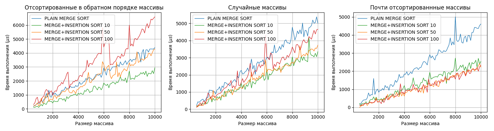

Ссылка на репозиторий
https://github.com/FloppaNeko/ADS_SET3_TaskA2

Для задачи __A2i__ реализован алгоритм MERGE+INSERTION SORT с параметром переключения 15 в файле `a2i.cpp`. На codeforces отправлена и прошла тесты посылка `292887299`

В файле `a2.cpp` релизованы испытания алгоритмов MERGE+INSERTION SORT с четрьмя разными параметрами: 1 (обычный MERGE SORT), 10, 50 и 100. Генераторы `ArrayGenerator` генерируют массивы с максимальной длиной, а также позволяют выбрать случайный подмассив из сгенерированного массива (это нужно для того, чтобы быстрей получать массивы меньшей длинны для тестирования). Такжи существуют три режима генерации массивов: _абсолютно случайные_ массивы, _отсортированные в обратном порядке_ массивы, а также _почти отсортированнные_ массивы.

Для большей точности результатов для каждого из случаев используется сразу 150 генераторов массивов.

Существенную проблему для измерения представляют оптимизация компилятора, из-за которой некоторые операции пропускаются, и время выполения становится неоправданно маленьким. Чтобы создать видимость того, что отсортированные массивы в программе далее где-то используются и пропускать сортировку нельзя, после сортировки они проверяются на корректность. Также для борьбы с оптимизацией я попытался отключить оптимизацию на этапе компиляции вот этой командой:

```
g++ -g -fno-elide-constructors -fno-inline -fno-builtin a2.cpp -o a2.exe
```

Результаты замеров времени работа алгоритмов в микросекундах $(\mu s)$ сохраняются в `data.csv` и визуализируются скриптом `graphs.py`



В общем случае (для полностью случайных массивов) все комбинированные сортировки действительно быстрее обычной сортировки слиянием. Лучшую скорость показывает сортировка с параметром 10, а сортировка-50 примерно на таком же уровне. 

Рассматривая случай отстортировнного в обратном порядке массива, тут сортировка-10 уже существенно превосходит остальные. Сортирока-50 находится на одном уровне с обычной, а сортировка-100 работает даже медленее.  

В другом крайнем случае, когда массив _почти_ отсторитирован в нужном порядке, смешанные алгоритмы значительно превосходят обычную сортировку. От параметра переключения их время работы зависит не сильно, хотя сортировки с большими параметрами все же немного быстрее. 

Обобщая все эти три случая можно сказать, что соритировка MERGE+INSERTION SORT действительно эффективнее обычной MERGE SORT, а 10 - наиболее оптимальный выбор параметра перехода из рассмотренных. 
